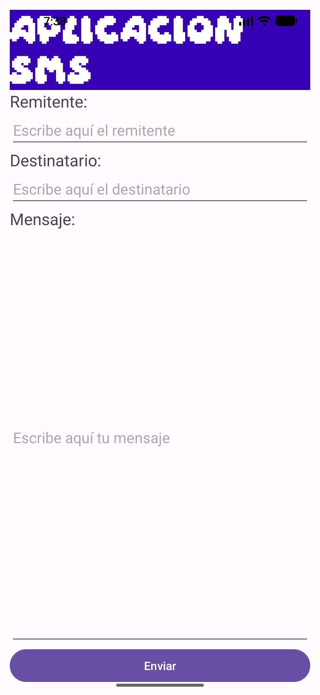
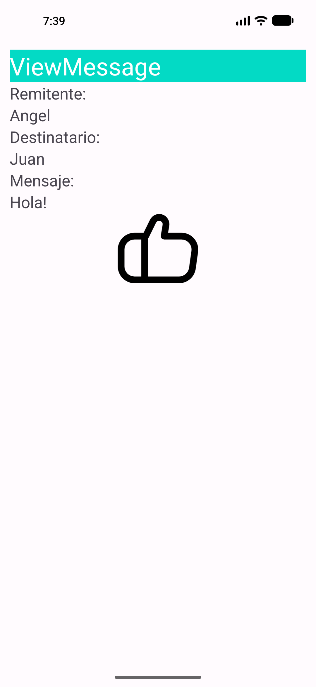
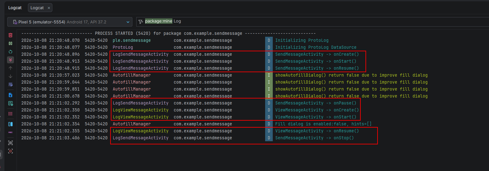
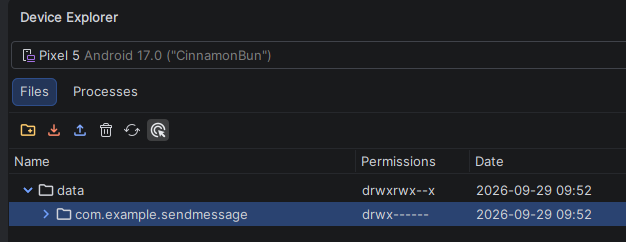

# App SendMessage

Aplicación sencilla desarrollada para el módulo de Desarrollo de Interfaces (
2º DAM). El objetivo de la app es enviar un texto introducido por el usuario desde una actividad
inicial a una segunda pantalla que muestra dicho contenido.

---

## 1. Capturas de pantalla de la app en ejecución

| Pantalla Principal (`SendMessageActivity`) | Pantalla de Recepción (`ViewMessageActivity`) |
| :---: | :---: |
|  |  |

---

## 2. Estructura del proyecto y decisiones de diseño

### Estructura general

* **`SendMessageActivity.kt`**: Actividad principal. Contiene la interfaz de entrada (`EditText`) y
  el botón (`Button`) para enviar los datos.
* **`ViewMessageActivity.kt`**: Actividad secundaria. Recibe los datos mediante el Intent y los
  muestra en el `TextView`.
* **`res/layout/`**: Contiene las vistas XML de ambas actividades (`activity_send_message.xml` y
  `activity_view_message.xml`).
* **`res/values/`**: Contiene colores (`colors.xml`), dimensiones (`dimens.xml`) y cadenas de
  texto (`strings.xml`).

### Decisiones de diseño

* **Uso de Bundles explícitos**: Para pasar la información entre actividades se optó por crear un
  objeto `Bundle` y empaquetar el mensaje mediante una clave constante (`KEY_MESSAGE`). Esto permite
  un código limpio y modular.
* **Mantenimiento del estilo visual**: Para dar continuidad a la app, ambas pantallas usan la misma
  paleta de colores (`teal_200` y `white`) en sus títulos y una distribución vertical mediante
  `LinearLayout`.

---

## 3. Proceso de depuración y evidencias de Logcat

Durante el desarrollo se revisaron los logs de la aplicación a través de la herramienta **Logcat**
de Android Studio para verificar la correcta instanciación de las actividades y descartar errores
durante el empaquetado de datos en el `Bundle`.

---

## 4. Conexión al directorio `/data/data/`

A través de la herramienta **Device Explorer** de Android Studio se verificó el directorio interno
donde la aplicación almacena sus ficheros en el emulador:

`/data/data/com.example.sendmessage/`

---

## 5. Enlaces a la documentación oficial

* [Android Developers - Intent y Filtros de Intent](https://developer.android.com/guide/components/intents-filters?hl=es-419)
* [Android Developers - Transferencia de datos entre actividades](https://developer.android.com/guide/components/activities/parcelable-and-bundle?hl=es-419)
* [Android Developers - Guía de layouts con LinearLayout](https://developer.android.com/develop/ui/views/layout/linear?hl=es-419)